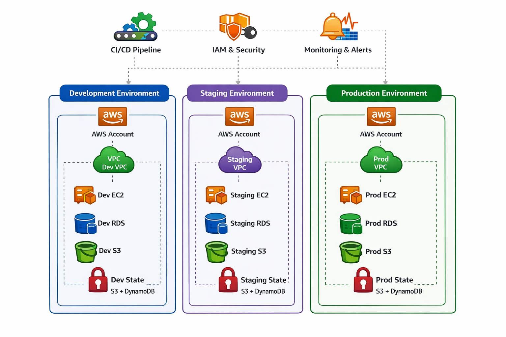

# Terraform Multi-Environment Project

This project demonstrates a best-practice directory structure for creating multi-environment infrastructure using Terraform.



## Structure

```
.
├── environments
│   ├── dev       # Development environment configuration
│   ├── prod      # Production environment configuration
│   └── bootstrap # Setup for S3 Remote Backend
└── modules
    ├── networking    # Shared networking module
    ├── compute       # Shared compute module
    └── remote-state  # Module for S3/DynamoDB State
```

## Usage

### Prerequisites
- Terraform installed
- AWS Credentials configured

### Running Terraform

**Development:**
```bash
cd environments/dev
terraform init
terraform plan
terraform apply
```

**Production:**
```bash
cd environments/prod
terraform init
terraform plan
terraform apply
```

### Remote State Setup (First Time Only)
This project uses S3 and DynamoDB for remote state management. You must provision these resources first.

```bash
cd environments/bootstrap
terraform init
terraform apply
```

Once the resources are created, the `dev` and `prod` environments will automatically use them (configured in their `main.tf`).

### Automation
A `Makefile` is included for common tasks:
- `make fmt`: Format all Terraform files.
- `make validate-all`: Validate configuration for both environments.